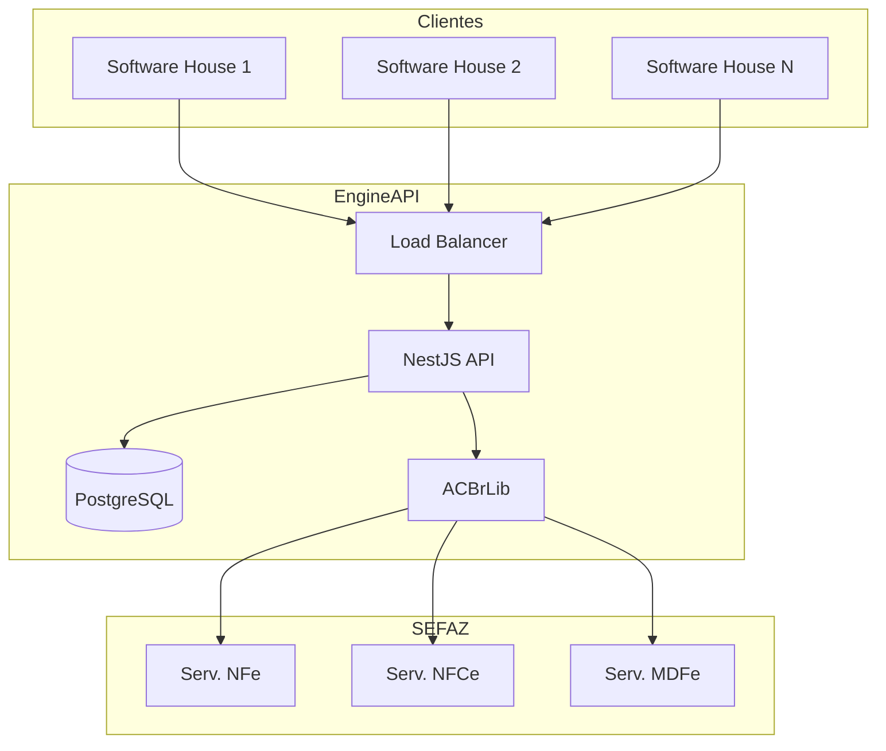
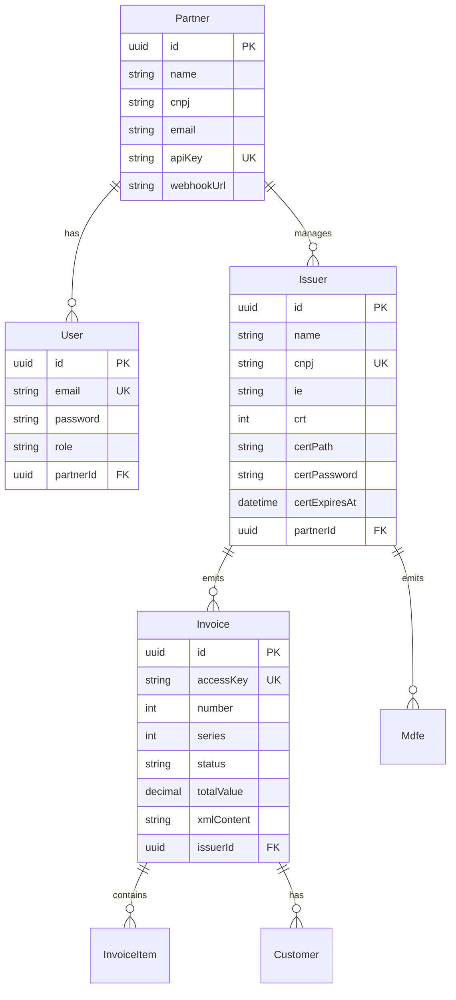
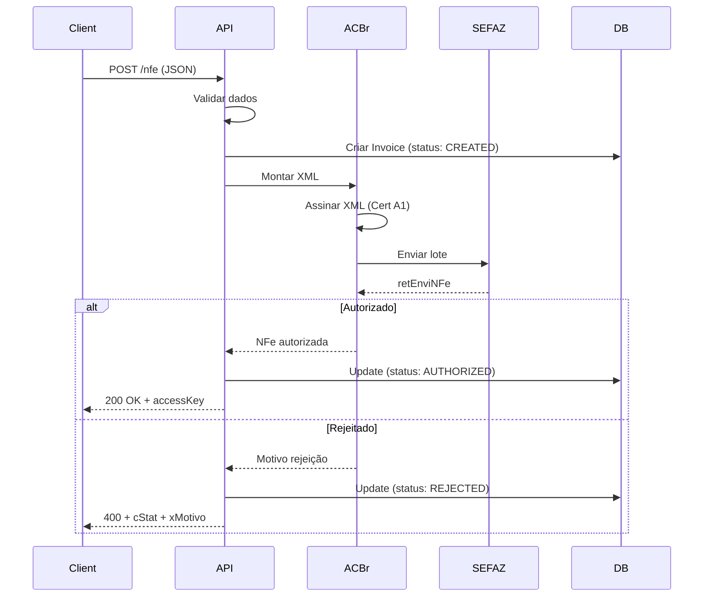

# Arquitetura EngineAPI

Este documento descreve a arquitetura técnica da plataforma EngineAPI.

## Visão Geral

EngineAPI é um Motor Fiscal SaaS multi-tenant que permite Software Houses integrar emissão de documentos fiscais eletrônicos em suas aplicações.

## Diagramas

### Arquitetura de Alto Nível



### Modelo de Dados



### Fluxo de Emissão



## Módulos

### Backend (NestJS)

| Módulo            | Responsabilidade                     |
| ----------------- | ------------------------------------ |
| `AuthModule`      | JWT auth, API Key auth, registro     |
| `AnalyticsModule` | Métricas, dashboard, KPIs            |
| `CompaniesModule` | CRUD de empresas, upload certificado |
| `NfeModule`       | Emissão NFe (Modelo 55)              |
| `NfceModule`      | Emissão NFCe (Modelo 65)             |
| `MdfeModule`      | Emissão MDFe (Modelo 58)             |
| `PartnersModule`  | Gestão de parceiros                  |

### Frontend (Next.js)

| Rota                  | Componente | Descrição           |
| --------------------- | ---------- | ------------------- |
| `/dashboard`          | `page.tsx` | Dashboard principal |
| `/dashboard/invoices` | `page.tsx` | Monitor de notas    |
| `/dashboard/mdfe`     | `page.tsx` | Monitor MDFe        |
| `/dashboard/settings` | `page.tsx` | Configurações       |
| `/dashboard/sandbox`  | `page.tsx` | Área de testes      |

## Segurança

### Autenticação

1. **JWT Bearer** - Para Dashboard web
   - Token válido por 24h
   - Contém: `userId`, `partnerId`, `role`

2. **API Key** - Para integrações server-to-server
   - Header: `X-API-Key`
   - Prefixo: `pk_live_` ou `pk_test_`

### Certificado Digital

- Tipo: A1 (arquivo .pfx)
- Armazenamento: Sistema de arquivos (Docker volume)
- Senha: Criptografada no banco

## Performance

### Rate Limits (Planejado)

| Plano      | Requests/min |
| ---------- | ------------ |
| Basic      | 100          |
| Pro        | 500          |
| Enterprise | Ilimitado    |

### Caching

- Prisma Query Cache
- Redis (planejado para sessões)

## Environments

### Mock Provider (Desenvolvimento)

- Não requer certificado
- Não conecta à SEFAZ
- Gera chaves de acesso simuladas
- DANFE em HTML

### Real Provider (Produção)

- Requer certificado A1 válido
- Conecta à SEFAZ real
- ACBrLib para assinatura
- DANFE via ACBr ImprimirPDF

## Deploy

### Docker Compose (Local/Staging)

```yaml
services:
  engine-api:
    build: ./backend
    ports: ["3001:3001"]
    environment:
      DATABASE_URL: postgresql://...
      NFE_PROVIDER: mock|real

  engine-api-db:
    image: postgres:15
    ports: ["5432:5432"]
    volumes:
      - db_data:/var/lib/postgresql/data
```

### Build para Apple Silicon

```bash
docker buildx build --platform linux/amd64 \
  -t engine_api-engine-api:latest --load \
  -f backend/Dockerfile backend/
```

## Monitoramento

### Logs

- NestJS Logger
- Winston (planejado)
- Formato JSON para agregação

### Métricas

- `/analytics/dashboard` - Métricas de negócio
- Prometheus endpoint (planejado)

## Changelog

### v2.0.0 (2026-02)

- ✅ Rebranding para EngineAPI
- ✅ Dashboard Analytics (Fase 2)
- ✅ Swagger Docs (Fase 3)
- ✅ MDFe completo (Modelo 58)

### v1.0.0 (2026-01)

- ✅ NFe emissão (Modelo 55)
- ✅ NFCe emissão (Modelo 65)
- ✅ Multi-tenant básico
- ✅ ACBrLib integração
